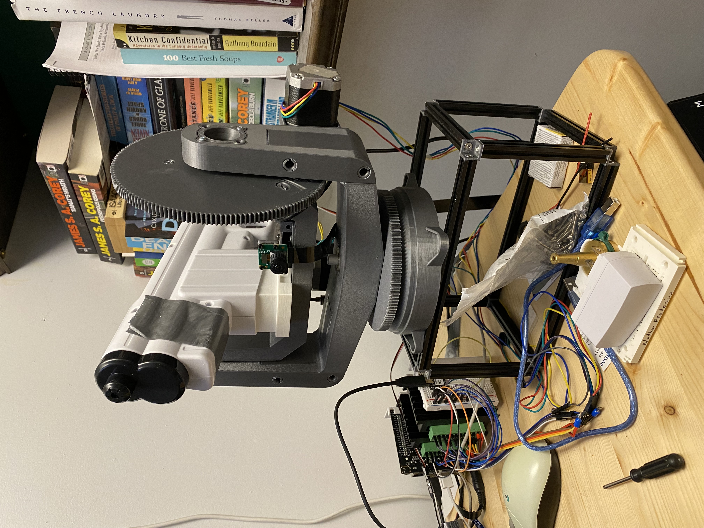

# PAWD: Precision Animal Watering Device

The goal of this project was to make a water turret to keep our dogs away from certain areas in the yard. It uses a Jetson Nano for inference, and an Arduino for low level motor control. 

 

### Startup 
Root priviledges are required for serial commands to the Arduino. 
1. Clone the repository
```
git clone git@github.com:npretor/PAWD.git && cd PAWD
```
2. Flash the Arduino with the provided serial motor control sketch under ./Arduino/MultiStepperSerialControl
3. Hookup the CSI camera to port 0
4. Start the script on the Jetson
```   
    sudo ./main.py 
```

### Hookup and assembly 
This repo runs on a Jetson Nano with a CSI camera. Selectable tracking targets are based on detectnet classes: 
* Cat - Class 18 
* Dog - Class 19 
* Person - Class 1


```
sudo docker run --runtime nvidia -it --rm --network=host -v /tmp/argus_socket:/tmp/argus_socket -v ~/github/PAWD/:/home/PAWD/ dustynv/opencv:r32.7.1
cd home/PAWD
source venv/bin/activate
pip3 install Flask nanocamera ipdb Pillow 
```