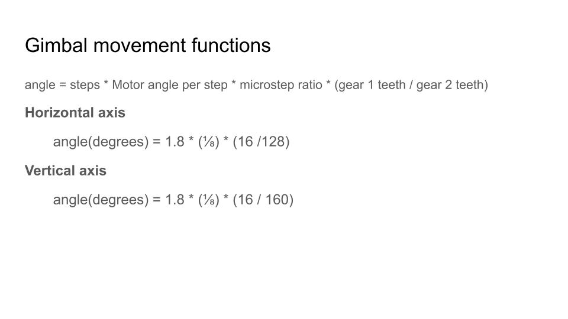

# PAWD Step 1: Building the mechanical parts and wiring it up

<a href="https://docs.google.com/spreadsheets/d/14U6JhJCDFgHJT2MQKJib40tnLick3FWL1bEg3CUnaLA/edit?usp=sharing"> Bill of materials </a>

## Print the parts and assemble
This took several days, but fairly standard. I followed the directions from this build: 
https://www.myminifactory.com/object/3d-print-camera-gimbal-95406
Printed the parts, glued the necessary pieces with 2-part fast bonding epoxy. 
I printed everything with FFF, except for the smallest gears - those were printed on my Elegoo Mars. 

## Wire up the motor controllers and connect to the jetson nano. 
I selected the jetson GPIO based on GPIO pins that didn't have I2C or UARTs, since i was thinking about using those for sensors and control triggers later.
I bought two <a href="https://www.pololu.com/product/1182">A4988 stepper motor drivers</a> that most 3D printers use for drivers. They are fairly cheap and well documented, I've used them before. I also used a regulated power supply based on the LM2596, and again they were cheap and i've used them before. They can't handle heavy loads, and aren't great when used at max capacity, but should for for testing, I'll probably switch them out later in the design. Finally, I used the recommended endstops - an inductive endstop with a digital out. Steppers were leftover steppers from an old 3D printer, part number: Kysan 1124090. 


Each stepper motor driver has a few options
- Enable
- 3 microstepping set pins
- Direction set pin
- Step pin 

The enable pin can be switched on and off to power the motors on and off. 
The 3 stepping pins are how you set the microstepping. For reference, steppers are driven by changing the internal coils in sequence, which causes the motor to move a fixed amount, or a step. The motors I selected move at 1.8 degrees per step, but can move in finer increments, or micro-steps, which are binary fractions of a full step. The stepper driver I have allows for serveral stepping options: 
Full step, half, quarter, eighth, and sixteenth steps. I'm selecting eighth stepping after some testing that I may adjust later. So, now to drive the motors. 

To drive the motors I'm using a Python library supplied by Nvidia called 
<a href="https://github.com/NVIDIA/jetson-gpio"> Jetson GPIO</a>

 

Driving the motors requires two signals, step and direction. To start things off, I wired up some sample test code to drive the motors. 
I wanted to see a few things: 
- How fast can I drive the stepping? I want to know at what speeds the motors sounds smooth. 
- What microstepping parameters should I use? 

In order to calculate the amount each axis of the gimbal will move, we have to use these calculations 
 

There are a few questions to figure out
- How to zero the axes when I can't revolve a full revolution. A full revolution would twist the ribbon cable and wires too much 
- At what speed to we start to lose steps? At high speeds steps start to get missed, and 1000 steps in 1 second will move less distance than 500 steps in 2 seconds. 

# PAWD Step 1: Testing live inferencing on the jetson nano

Setup the Jetson Nano
1. Flash the SD card with Balena Etcher and Jetpack 4.6 
2. Download the detectnet example
```
cd ~
git clone https://github.com/dusty-nv/jetson-inference.git
cd jetson-inference/blob/master/python/examples
```
3. Connect the ribbon cable and note the zif connector number (0 or 1).
4. Verify the power settings are at MAXN
```
sudo nvpmodel -m 0
``` 
5. Run the demo, selecting the correct connector
```
cd 
./detectnet.py csi://0
```

### Object locating
1. Sort the detected objects for a desired object
2. Get the bounding box center 
3. Calculate error relative to the image center 

### A few more considerations
1. The detections are not continuous between frames
2. What should the update speed be? 


## Writing a motor driver 

Requirements
- Detect limits of travel
- Smoothing and ramping 


Non-motor-driver-requirements
* Apply smoothing to the detectnet locations to 

